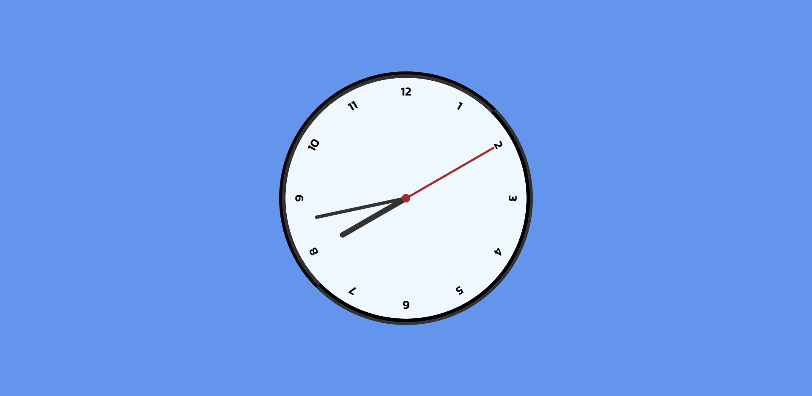

<h1 align="center"> Relógio </h1>

Relógio com ponteiros criado com HTML, CSS e JavaScript, com base nos ensinamentos do vídeo - [Como criar um relógio com HTML, CSS e JavaScript #html #css #javascript](https://youtu.be/FJGNnYG50gA) do canal [@ManualdoDev](https://www.youtube.com/@ManualdoDev) no Youtube. 

 

  <a href="#-tecnologias">🚀 Tecnologias</a>&nbsp;&nbsp;&nbsp;|&nbsp;&nbsp;&nbsp;
  <a href="#-projeto">💻 Projeto</a>&nbsp;&nbsp;&nbsp;|&nbsp;&nbsp;&nbsp;
  <a href="#-layout">🔖 Layout</a>&nbsp;&nbsp;&nbsp;|&nbsp;&nbsp;&nbsp;
  <a href="#memo-licença">:memo: Licença</a>

 

  

 

## 🚀 Tecnologias

Esse projeto foi desenvolvido com as seguintes tecnologias:

 

## 💻 Projeto

O projeto é um relógio com ponteiros que apresenta o horário atual.

 

## 🔖 Layout

Você pode navegar pelo projeto através [DESSE LINK](https://thiagomonts.github.io/clock/).

 

## :memo: Licença

Esse projeto está sob a licença MIT.

 

---

Desenvolvido por [Thiago Honorato](https://www.linkedin.com/in/honoratothiago/)
